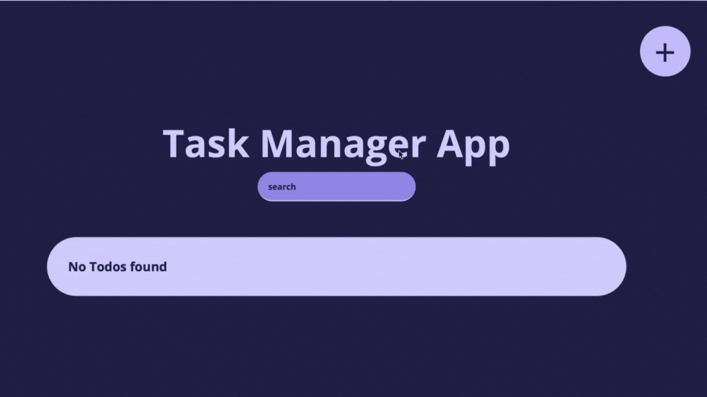

<h1 align="center">
  <br>
  Todo App
  <br>
</h1>

<h4 align="center">A simple Todo app</h4>

<p align="center">
  <a href="#key-features">Key Features</a> •
  <a href="#how-to-use">How To Use</a> •
  <a href="#license">License</a>
</p>



## Key Features

- create Todos
- mark Todos as done
- delete Todos
- filter Todos

## How To Use

To clone and run this application, you'll need [Git](https://git-scm.com) and [Node.js](https://nodejs.org/en/download/) (which comes with [npm](http://npmjs.com)) installed on your computer. From your command line:

```bash
# Clone this repository
$ git clone https://github.com/CH4692/todo-app.git

# Go into the repository
$ cd todo-app

# Install dependencies
$ npm install

# Add a environment variable
# add a .env file in your ./todo-app folder
# add DATABASE_URL="file:./dev.db" to your .env file

# migrate prisma schema to your database
$ npx prisma migrate dev --name init
```

## License

MIT

---

GitHub [@CH4692](https://github.com/CH4692) &nbsp;&middot;&nbsp;
LinkedIn [@CharlesHeller](https://www.linkedin.com/in/charles-heller-068b53233/)
